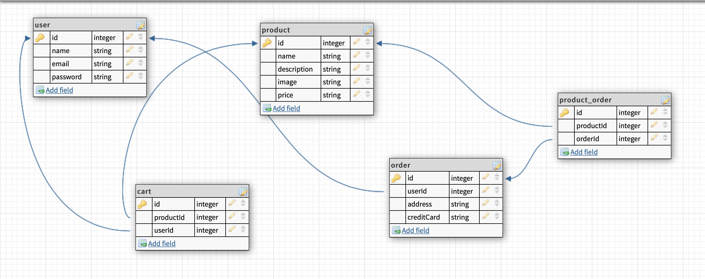

# HANDMADE

## Overview

An e-commerce website that allows users to buy exclusive, unique and handmade ONLY products.

## User Stories

1. When I first visit the site, I'm on a home page that has all products displayed.
2. When not logged in, I see links to home, signup & login only. If I were to visit any of these routes manually while logged in, I would get redirected to the home page.
3. I can create an account, log in, and log out.
4. When logged in, I see links to home, logout, My Cart, and My Orders.
5. The Home page lists the names of all available products. Clicking on any product name takes me to its details page, which include a name, description, image, and price. The products are pre-seeded in the db. In the Product Details page is an Add To Cart button, which saves the product in my cart. 
6. When I'm in My cart page, I see list of products I added. I see checkout button, when I click on it I need to input shipping address and CC number.
7. After I purchaseed products I can see the order list in My orders page. When I click on order I can see the details of the order, products and total amount.

## Wireframes

## Component diagram

## ERD

## Routes Inventory

|Method|Path|Description|
|---|---|---|
|POST|/users/signup|create new user|
|POST|/users/login|user login|
|GET|/users/verify|user verify|
|POST|/users/cart|add products in cart|
|GET|/users/cart|show products in cart|
|DELETE|/users/cart/:id|remove product from cart|
|GET|/products/:id|show single product|
|GET|/products|show all products|
|POST|/orders|create new order|
|GET|/orders/:id|show single order details|
|GET|/orders|show my orders|

## MVP 

1. Create database, tables, associations, routes.
2. User auth
3. Sign up, Login forms, Logout
4. Home page with list of all products.
5. Add to cart
6. See products that was added into the cart
7. Checkout form
8. My orders page to see list of all orders.

## Stretch goals

1. Implement payment system, maybe stripe or paypal.
2. Have multiple sellers.
3. Sellers can add, update or delete product.

